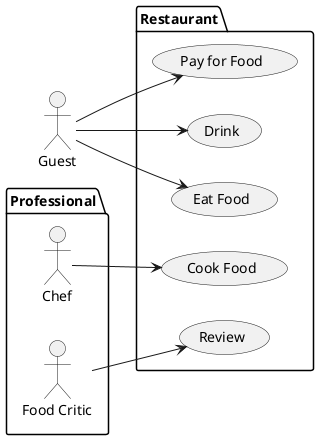
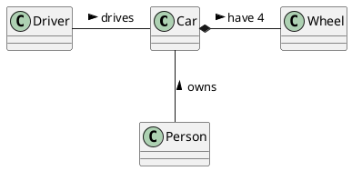

# Student information system - Exams

The Student Information System (SIS) Exams Module is an integral component of the university's academic infrastructure, designed to streamline the management of examination-related processes for both students and faculty. This module provides a comprehensive platform to efficiently administer, schedule, monitor, and evaluate exams, ensuring smooth operations during the assessment period.

## Functional Requirements

This section specifies the functional requirements.

### User requirements

**Students**
- If an exam is full, I should be able to put myself in a waiting queue that will automatically sign me up for the exam if a spot opens up, because I do not want to check it too often.
- I should be able to view my exam schedule/calendar, because with a lot of enrolled exams, a list view may be disorienting.
- I should be able to filter available exams based on the course they belong to, and whether I have already passed them, because it will be less distracting for me.
- As a student, I should be able to enroll in exams and assessments because I need to fulfill my academic requirements.
- As a student, I should be able to view my examination results as soon as they are published because I want to keep track of my academic progress.
- As a student, I should be able to view my examination history, including past scores and feedback, because I want to evaluate my academic performance over time.
- As a student, I should be able to download or print my exam results for my records because I may need them for personal documentation or verification purposes.
**Teachers**
- I should be able to kick out enrolled students automatically if they have not yet fulfilled criteria needed for the enrollment (e.g. credit), because it will be tedious to do so manually.
- As examiner, I should be able to publish exam results efficiently because it is essential to provide timely feedback to students.
- As examiner, I should be able to manage the enrollment lists for the courses I am teaching because I need to prepare for the assessment process accordingly.
- As examiner, I should be able to provide detailed feedback on student performance because it helps students learn from their mistakes and achievements.

### System requirements

#### Actors

[*Document here all actors from the use case diagrams. Make a subsection for each actor and their short description in each subsection.*]

##### [*Actor name*]

[*Actor description*]

#### Use cases

[*Document here all use cases. Create a subsection for each use case diagram. If you have only one use case diagram, you do not need a special subsection.*]

##### [*Use case diagram title*]

[*Use case diagram in PlantUML*]

To be able to embed PlantUML diagrams to Markdown code with previews in VSCode you need
* Markdown All in One extension
* PlantUML extension
View > Command Pallete... > Markdown All in One: Print current document to HTML

Follow https://plantuml.com/

[*Describe the diagram in a short paragraph. Describe each use case from the diagram in the detail from the lecture in a separate subsection.*]

###### [*Use case title*]

[*Use case description in the structure from the lecture.*]

[*Add an activity diagram for one use case per a team member*]

## Information model

[*Express the information model of the domain as a UML class diagram in PlantUML. Do not use class methods in the diagram, only classes, class attributes and associations connecting classes.*]

[*Document each class with in a separate subsection*]

### [*Class name*]

[*Class description consisting of its definition, description of its essential properties (attribues and associations).*]